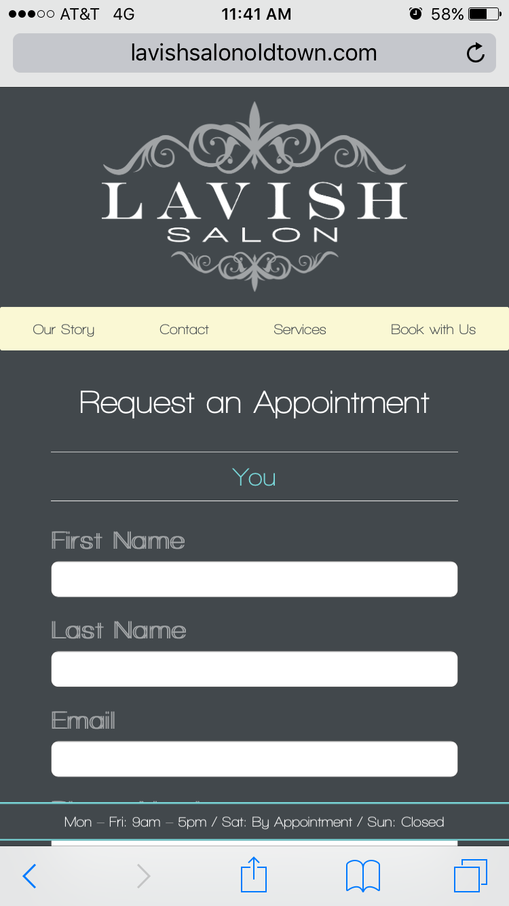
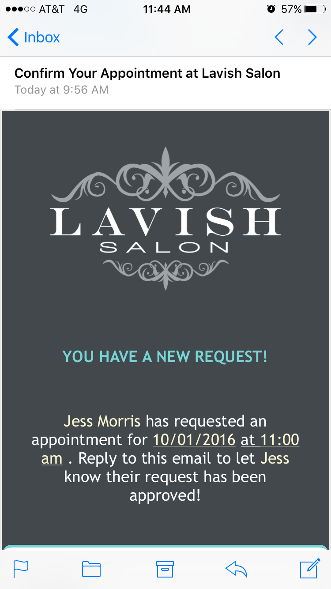

##Lavish Salon

  

  Lavish Salon is a beauty parlor based out of Oldtown, Idaho. It was founded by Amanda Johnson in early 2016.
  This website is designed with the client in mind; it is both desktop & mobile friendly.

   

  Users can submit requests for appointments, and Amanda will receive an email with their information.

  

  If the appointment is approved, Amanda will then add the client's request to her editable admin-side calendar. The information on Amanda's admin calendar is reflected on the client-side, sans client information, to prevent clients from booking appointment times that are already taken.

   

  This project was created with jQuery, AngularJS, HTML/CSS, Bootstrap, Knex, and Node.

